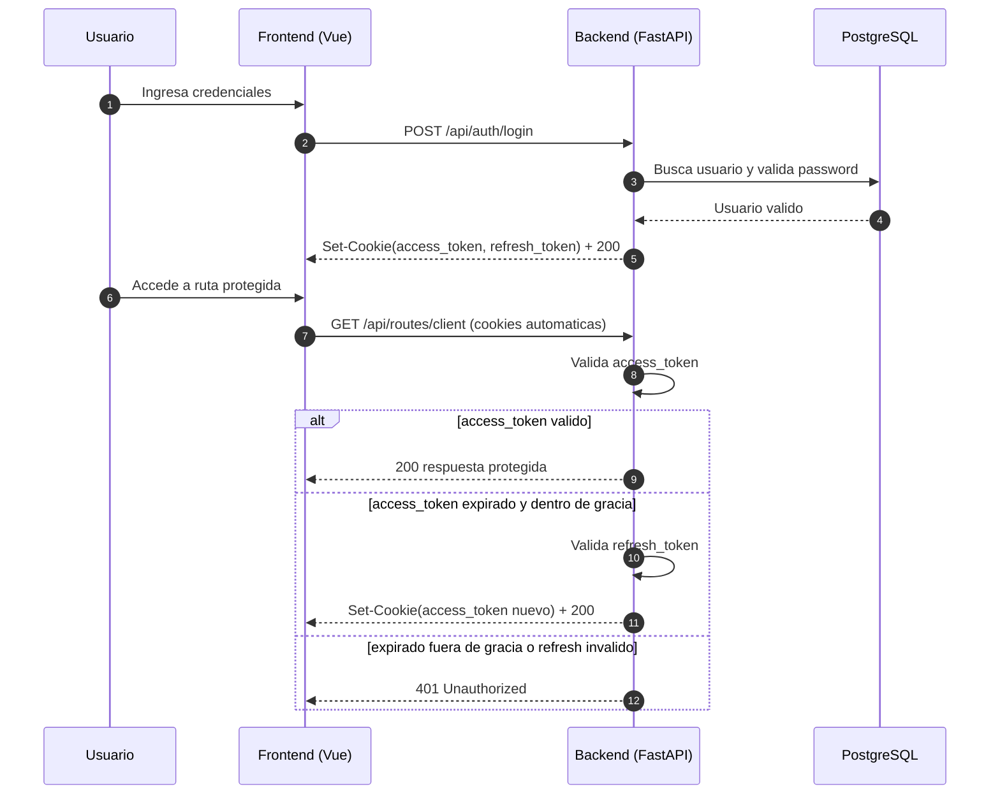

# Modulo de Registro/Login con JWT, Vue, FastAPI y PostgreSQL

Este proyecto implementa un modulo completo de autenticacion y autorizacion con:

- Backend: FastAPI (Python)
- Frontend: Vue 3 + Vite
- Base de datos: PostgreSQL
- Contenedores: Docker Compose

## Cumplimiento de requisitos

1. Frontend y backend se comunican por API REST.
2. La autenticacion usa JWT.
3. Los JWT se guardan en cookies HTTP-only (no accesibles por JavaScript).
4. El tiempo de vida del JWT se controla por variable de entorno (`ACCESS_TOKEN_EXPIRE_MINUTES`).
5. Existe renovacion automatica del access token si expiro y aun esta dentro de la ventana de gracia (`REFRESH_GRACE_MINUTES`) y el refresh token sigue valido.
6. Los datos sensibles se almacenan cifrados con AES (AES-GCM con clave simetrica derivada desde `AES_SECRET_KEY`). El password ademas se protege con hash bcrypt antes del cifrado.

## Objetivos Generales

Aplicar los conocimientos adquiridos para generar software de alta calidad y escalable usando tecnicas de desarrollo modernas.

## Objetivos Especificos

- Elegir herramientas utiles para la tarea asignada.
- Familiarizarse con metodos de autenticacion modernos.

## Estructura del proyecto

```text
.
|-- Backend/
|   |-- app/
|   |   |-- api/
|   |   |-- core/
|   |   |-- db/
|   |   |-- schemas/
|   |   `-- services/
|   |-- Dockerfile
|   |-- requirements.txt
|   `-- .env.example
|-- Frontend/
|   |-- src/
|   |-- Dockerfile
|   |-- package.json
|   `-- .env.example
|-- .gitignore
|-- docker-compose.yml
`-- README.md
```

## Variables de entorno

### Backend (`Backend/.env`)

Copiar y ajustar:

```powershell
Copy-Item Backend/.env.example Backend/.env
```

Variables principales:

- `DATABASE_URL`: conexion PostgreSQL.
- `JWT_SECRET_KEY`: secreto de firmado JWT.
- `ACCESS_TOKEN_EXPIRE_MINUTES`: vida del access token.
- `REFRESH_TOKEN_EXPIRE_MINUTES`: vida del refresh token.
- `REFRESH_GRACE_MINUTES`: ventana extra para renovar automaticamente access token expirado.
- `COOKIE_SECURE`: `true` para HTTPS productivo.
- `COOKIE_SAMESITE`: politica de cookie (`lax`, `strict`, `none`).
- `AES_SECRET_KEY`: clave base para cifrado AES.
- `ADMIN_CREATION_KEY`: clave para permitir registro como admin.
- `FRONTEND_ORIGIN`: origen permitido por CORS.

### Frontend (`Frontend/.env`)

```powershell
Copy-Item Frontend/.env.example Frontend/.env
```

- `VITE_API_BASE_URL=http://localhost:8000/api`

## Ejecucion con Docker

1. Crear archivos `.env`:

```powershell
Copy-Item Backend/.env.example Backend/.env
Copy-Item Frontend/.env.example Frontend/.env
```

2. Levantar contenedores:

```powershell
docker compose up --build
```

3. URLs:

- Frontend: `http://localhost:5173`
- Backend: `http://localhost:8000`
- Swagger: `http://localhost:8000/docs`

## Flujo funcional

1. Registrar usuario cliente o admin (admin requiere `ADMIN_CREATION_KEY`).
2. Login crea `access_token` y `refresh_token` en cookies HTTP-only.
3. Dashboard verifica login exitoso y permite probar rutas protegidas.
4. Si `access_token` expiro hace menos de `REFRESH_GRACE_MINUTES`, backend lo renueva automaticamente usando `refresh_token`.

## Rutas de autorizacion por rol

- Ruta 1 (`/api/routes/admin`): solo `admin`.
- Ruta 2 (`/api/routes/client`): `client` y `admin`.

## Explicacion breve de tecnologias solicitadas

### 1. Herramientas usadas y pros/contras

- FastAPI
  - Ventajas: alto rendimiento, tipado con Pydantic, docs automaticas.
  - Desventajas: ecosistema mas pequeno que Django para funcionalidades empresariales completas.
- Vue 3 + Vite
  - Ventajas: curva de aprendizaje amigable, rapido para SPA, build veloz.
  - Desventajas: requiere decisiones adicionales para arquitectura grande.
- PostgreSQL
  - Ventajas: robusto, ACID, SQL avanzado, excelente para produccion.
  - Desventajas: requiere administracion y tuning segun carga.
- Docker Compose
  - Ventajas: entorno reproducible y facil de levantar.
  - Desventajas: en produccion suele complementarse con orquestacion.

### 2. Cookies HTTP/HTTPS only y AES

- Cookie HTTP-only: no puede ser leida por JavaScript del navegador, reduciendo impacto de XSS.
- Cookie Secure/HTTPS-only: solo se envia por HTTPS.
- AES: algoritmo de cifrado simetrico por bloques; en este proyecto se usa AES-GCM (modo autenticado) para cifrar/descifrar informacion sensible.

### 3. JWT y autenticacion

JWT (JSON Web Token) es un token firmado que contiene claims como `sub`, `role` y `exp`.
Permite autenticar requests sin sesion tradicional en servidor por cada usuario.
En este proyecto se entrega y persiste en cookies HTTP-only.

### 4. Diagrama de secuencia del modulo de autenticacion JWT



## Endpoints principales

- `POST /api/auth/register`
- `POST /api/auth/login`
- `POST /api/auth/logout`
- `GET /api/auth/me`
- `GET /api/routes/admin`
- `GET /api/routes/client`
- `GET /health`

## Recomendaciones de seguridad para produccion

- Cambiar `JWT_SECRET_KEY`, `AES_SECRET_KEY` y `ADMIN_CREATION_KEY`.
- Activar `COOKIE_SECURE=true` en HTTPS.
- Restringir `FRONTEND_ORIGIN` al dominio real.
- Implementar rotacion de claves y auditoria de accesos.
