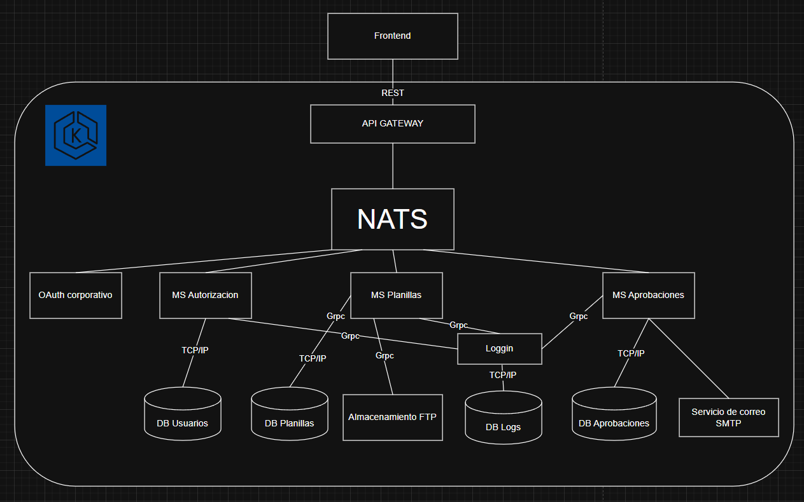
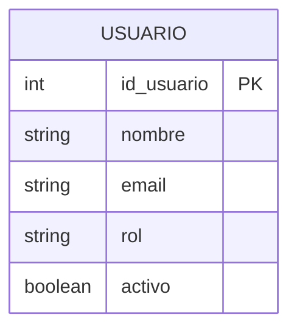
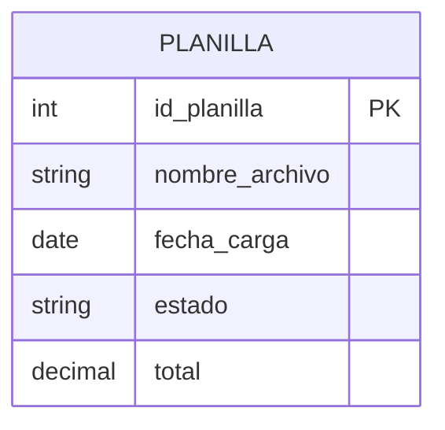
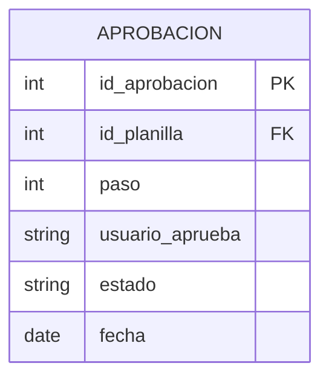

# PRÁCTICA 3  
---

### 1. MARCO FORMATIVO

## 1.1 Valor

| Nombre del valor | ¿Cómo se aplica en el laboratorio? |
|------------------|--------------------------------------|
| Responsabilidad | Diseño arquitectónico estructurado, documentación clara y separación adecuada de microservicios. |

---

## 1.2 Competencias

**Competencia General:**  
Diseñar soluciones de software escalables y mantenibles utilizando arquitecturas modernas y principios de ingeniería de software.

**Competencia Específica:**  
Diseñar una arquitectura basada en microservicios para un sistema de planillas empresariales.

---

## 1.3 Objetivo SMART

El estudiante será capaz de diseñar una arquitectura distribuida basada en microservicios para un sistema de planillas empresariales, documentando:

- Diagrama de arquitectura  
- Diseño de microservicios  
- Diagramas ER independientes  
- Flujo de aprobación  
- Estrategia de almacenamiento y logging  

Entrega antes del 18 de abril de 2026.

### 3. DIAGRAMA DE ARQUITECTURA

---

# 4. DISEÑO DE MICROservicios

## 4.1 MS Autorización

### Responsabilidad
- Validar token OAuth.  
- Administrar roles y permisos.  
- Autorizar acceso a recursos.  

### Base de Datos
DB Usuarios (independiente).

---

## 4.2 MS Planillas

### Responsabilidad
- Recepción de archivo CSV.  
- Validación de reglas del negocio.  
- Gestión de historial.  
- Envío al sistema financiero externo.  

### Base de Datos
DB Planillas (independiente).

---

## 4.3 MS Aprobaciones

### Responsabilidad
- Gestionar flujo de aprobación en 3 pasos.  
- Controlar estados.  
- Disparar notificación final.  

### Flujo
1. Revisión inicial  
2. Validación intermedia  
3. Aprobación final  

Al aprobar:
- Se envía correo.  
- Se notifica al sistema financiero.  

---
  

# 5. DIAGRAMAS ER

## 5.1 ER – MS Autorización

---

## 5.2 ER – MS Planillas

---

## 5.3 ER – MS Aprobaciones

---

# 6. FLUJO DE APROBACIÓN

1. Usuario carga planilla.  
2. Se valida y guarda en estado "Pendiente".  
3. Pasa a aprobación Paso 1.  
4. Si es aprobada, pasa a Paso 2.  
5. Luego Paso 3.  
6. Al aprobar Paso 3:
   - Estado cambia a "Aprobado".  
   - Se envía correo a empleados.  
   - Se envía información al sistema financiero externo.  

---

# 7. ESTRATEGIA DE ALMACENAMIENTO CSV

- Archivos almacenados en Cloud Storage o FTP.  
- En base de datos solo se guarda:
  - Nombre del archivo  
  - Ruta  
  - Fecha de carga  
  - Estado  

---

# 8. ESTRATEGIA DE LOGGING

Todos los microservicios envían registros a un servicio centralizado de logging para:

- Auditoría  
- Seguridad  
- Trazabilidad  

---

# 9. COMUNICACIÓN ENTRE SERVICIOS

Se utiliza comunicación REST mediante API Gateway.

Flujos principales:

- API Gateway → Microservicios  
- Planillas → Aprobaciones  
- Aprobaciones → Notificación correo  
- Planillas → Sistema financiero  

---

# 10. PROPUESTA DE API GATEWAY

Funciones:

- Punto único de entrada  
- Validación de token OAuth  
- Enrutamiento a microservicios  
- Seguridad centralizada  

---

# 11. JUSTIFICACIÓN ARQUITECTÓNICA

La arquitectura basada en microservicios permite:

- Escalabilidad independiente  
- Mejor mantenimiento  
- Separación clara de responsabilidades  
- Mejor rendimiento en alta demanda  
- Despliegue independiente por servicio  