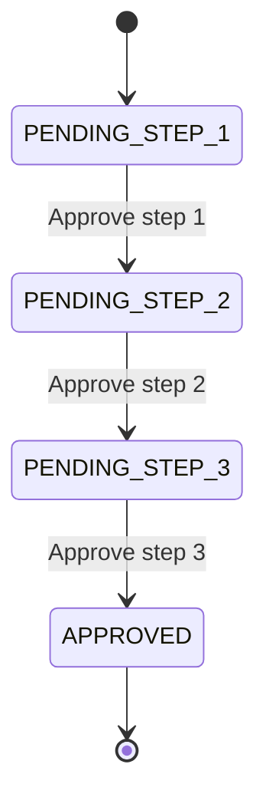

# Flujo de aprobacion de 3 pasos

## Reglas
- Solo puede aprobarse el paso actual.
- Si `step` recibido no coincide con `current_step`, se rechaza.
- En paso 3:
  - Se integra con sistema financiero externo.
  - Se notifica por correo a empleados de la planilla.
  - Se registra auditoria final.
