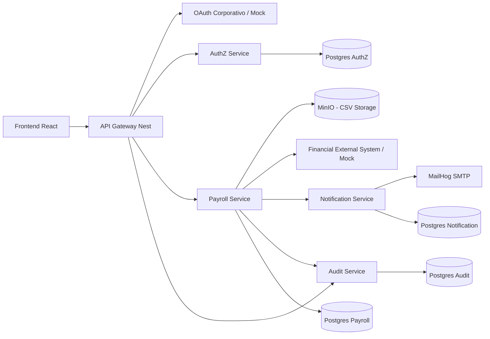

# Diagrama de Arquitectura General

## Comunicacion entre servicios
- Cliente -> Gateway: REST.
- Gateway -> AuthZ/Payroll/Audit: REST.
- Payroll -> Notification/Finance/Audit: REST.

## Justificacion
- Desacopla modulos de negocio criticos.
- Escalamiento independiente por servicio.
- Reduce impacto de picos de carga en procesos de planillas.
