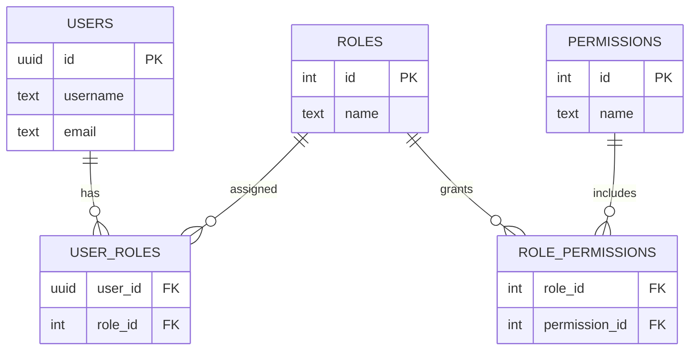
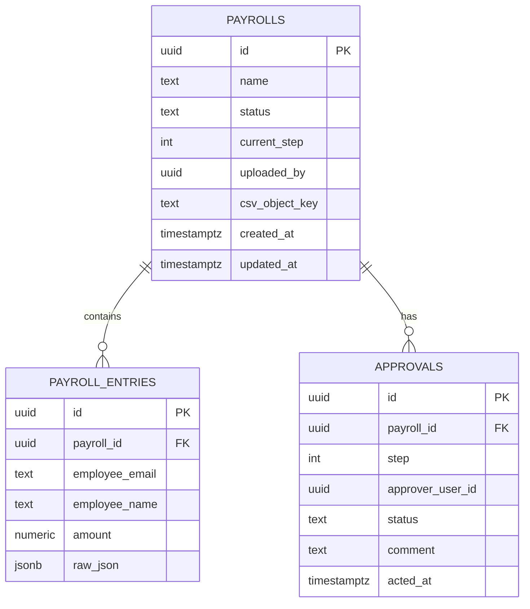
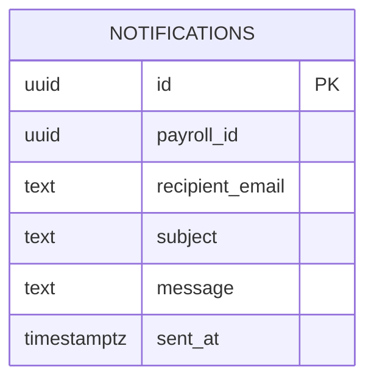
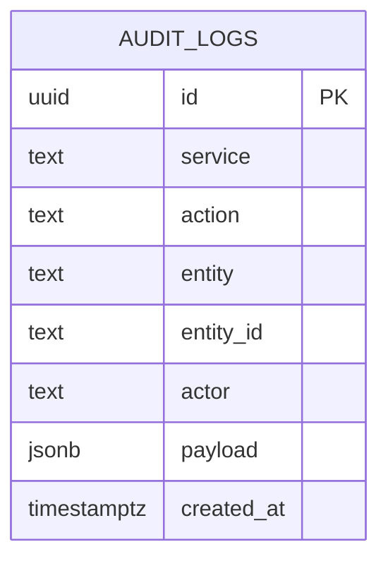

# Diagramas ER por servicio

## AuthZ Service

```mermaid
erDiagram
  USERS ||--o{ USER_ROLES : has
  ROLES ||--o{ USER_ROLES : assigned
  ROLES ||--o{ ROLE_PERMISSIONS : grants
  PERMISSIONS ||--o{ ROLE_PERMISSIONS : includes

  USERS {
    uuid id PK
    text username
    text email
  }
  ROLES {
    int id PK
    text name
  }
  PERMISSIONS {
    int id PK
    text name
  }
  USER_ROLES {
    uuid user_id FK
    int role_id FK
  }
  ROLE_PERMISSIONS {
    int role_id FK
    int permission_id FK
  }
```

## Payroll Service

```mermaid
erDiagram
  PAYROLLS ||--o{ PAYROLL_ENTRIES : contains
  PAYROLLS ||--o{ APPROVALS : has

  PAYROLLS {
    uuid id PK
    text name
    text status
    int current_step
    uuid uploaded_by
    text csv_object_key
    timestamptz created_at
    timestamptz updated_at
  }
  PAYROLL_ENTRIES {
    uuid id PK
    uuid payroll_id FK
    text employee_email
    text employee_name
    numeric amount
    jsonb raw_json
  }
  APPROVALS {
    uuid id PK
    uuid payroll_id FK
    int step
    uuid approver_user_id
    text status
    text comment
    timestamptz acted_at
  }
```

## Notification Service

```mermaid
erDiagram
  NOTIFICATIONS {
    uuid id PK
    uuid payroll_id
    text recipient_email
    text subject
    text message
    timestamptz sent_at
  }
```

## Audit Service

```mermaid
erDiagram
  AUDIT_LOGS {
    uuid id PK
    text service
    text action
    text entity
    text entity_id
    text actor
    jsonb payload
    timestamptz created_at
  }
```
